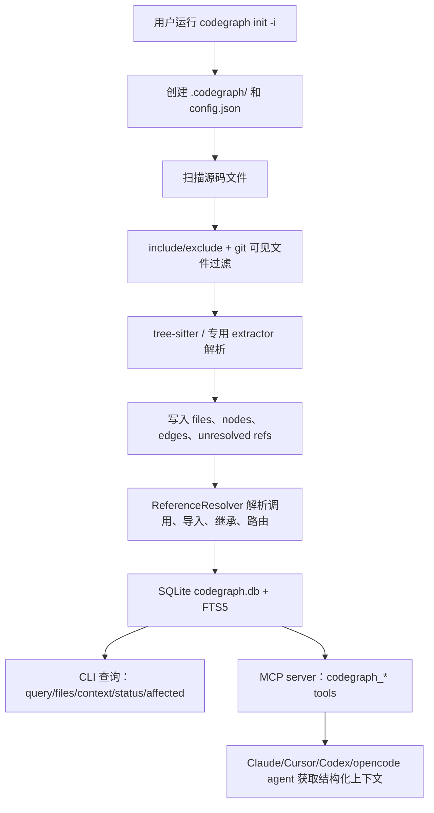

# colbymchenry/codegraph 架构分析

## 源码结构概览

```text
src/
  bin/                 CLI 入口，commander 命令定义
  installer/           交互式安装器与各 agent 配置写入
  mcp/                 MCP server、工具定义、server instructions
  extraction/          tree-sitter 语言解析、文件扫描、索引 orchestrator
  resolution/          引用解析、框架路由识别、路径别名
  graph/               图遍历、图查询
  context/             根据任务构建 AI 上下文
  db/                  SQLite adapter、schema、migration、queries
  sync/                文件 watcher 与增量同步
  ui/                  CLI 进度展示
```

测试主要在 `__tests__/`，覆盖 installer、frameworks、graph、context、sqlite backend、sync、watcher、extraction、security 等。

## 入口文件

### CLI 入口

`src/bin/codegraph.ts` 是 npm bin `codegraph` 的入口。`package.json` 中声明：

```json
{
  "bin": {
    "codegraph": "./dist/bin/codegraph.js"
  }
}
```

CLI 行为：

- 无参数时运行交互式 installer。
- 有参数时进入 commander 命令分发。
- 在启动早期阻断 Node 25，除非设置 `CODEGRAPH_ALLOW_UNSAFE_NODE`。
- 懒加载 `../index` 和 `../installer`，减少 CLI 启动开销。

主要命令：

- `init [path]`
- `uninit [path]`
- `index [path]`
- `sync [path]`
- `status [path]`
- `query <search>`
- `files`
- `context <task>`
- `serve --mcp`
- `unlock [path]`
- `affected [files...]`
- `install`

### Library 入口

`src/index.ts` 导出 `CodeGraph` 主类和若干类型/工具函数。核心生命周期：

- `CodeGraph.init(projectRoot, options)`
- `CodeGraph.open(projectRoot, options)`
- `indexAll()`
- `sync()`
- `watch()`
- `unwatch()`
- `close()`

## 核心模块

### 配置与目录

`src/directory.ts` 负责 `.codegraph/` 管理：

- `createDirectory()` 创建 `.codegraph/` 和 `.codegraph/.gitignore`。
- `isInitialized()` 要求 `.codegraph/` 和 `.codegraph/codegraph.db` 都存在。
- `removeDirectory()` 删除 `.codegraph/`，并避免跟随 symlink。
- `findNearestCodeGraphRoot()` 从当前路径向上查找已初始化项目。

`src/config.ts` 负责 `.codegraph/config.json`：

- `loadConfig()` 合并默认配置。
- `saveConfig()` 原子写入配置。
- `validateConfig()` 校验字段类型，并对 custom regex pattern 做安全检查。

### 索引与抽取

`src/extraction/index.ts` 的 `ExtractionOrchestrator` 负责：

1. 扫描应索引文件。
2. 按 include/exclude glob 过滤。
3. 优先使用 git 可见文件列表，失败时回退到文件系统扫描。
4. 通过 worker thread 调 tree-sitter 解析源码。
5. 写入 file records、nodes、edges、unresolved references。
6. 对单文件解析设置 10 秒超时，避免 tree-sitter 或 WASM 卡死整个索引。

语言支持分散在：

- `src/extraction/languages/*.ts`
- `src/extraction/svelte-extractor.ts`
- `src/extraction/vue-extractor.ts`
- `src/extraction/liquid-extractor.ts`
- `src/extraction/dfm-extractor.ts`

### 引用解析与框架识别

`src/resolution/` 负责把抽取阶段留下的 unresolved references 转成图边。可见模块包括：

- `import-resolver.ts`
- `name-matcher.ts`
- `path-aliases.ts`
- `strip-comments.ts`
- `frameworks/`

`frameworks/` 下包含 Django/FastAPI/Flask、Express、Laravel、Rails、Spring、Go web frameworks、Rust web frameworks、ASP.NET、Vapor、React Router、SvelteKit、Vue/Nuxt 等路由识别逻辑。README 说明路由会生成 `route` node，并用 `references` edge 连接到 handler。

### 图查询与上下文构建

`src/graph/` 提供图遍历和查询管理。`src/context/` 根据任务构建 AI 上下文。CLI 的 `codegraph context <task>` 和 MCP 的 `codegraph_context` 都依赖这一层。

本地验证中，`context "login flow"` 会输出：

- `Entry Points`
- `Related Symbols`
- `Code`

这说明它不是单纯全文搜索，而是先找入口符号，再收集相关符号和源码片段。

### MCP server

`src/mcp/tools.ts` 定义工具 schema 和 handler。所有工具支持可选 `projectPath`，可跨项目查询其他已初始化 `.codegraph/` 项目。

`src/mcp/server-instructions.ts` 在 MCP initialize 响应中给 agent 一段工具选择说明。它强调：

- 结构性问题先用 CodeGraph。
- `codegraph_context` 是主工具。
- 重构规划常见链路是 `search -> callers -> impact`。
- 不要在刚编辑后立即查询索引，因为 watcher 有短暂滞后。

### Installer

`src/installer/targets/` 定义各 agent 的配置目标：

- `claude.ts`
- `cursor.ts`
- `codex.ts`
- `opencode.ts`
- `registry.ts`
- `shared.ts`

每个 target 实现类似接口：检测、安装、卸载、打印配置、描述路径。Codex 目标只支持 global，因为源码注释说明 Codex CLI 当前没有项目本地 config 概念。

### 数据库

`src/db/` 包含：

- `schema.sql`
- `migrations.ts`
- `queries.ts`
- `sqlite-adapter.ts`

README 明确数据库是 SQLite，并使用 FTS5 做全文搜索。`package.json` 把 `better-sqlite3` 放在 `optionalDependencies`，同时依赖 `node-sqlite3-wasm` 作为 fallback。

## 数据流



## 设计决策

### 本地优先

项目不需要 API key，不依赖远程索引服务。README 明确写“100% local”，源码也显示索引数据写入项目目录下 SQLite。

### 每个项目独立索引

`.codegraph/` 放在项目根目录。这样好处是不同项目隔离，缺点是每个项目都要初始化和维护索引。

### 使用 tree-sitter 而不是 LSP

tree-sitter 可以跨语言快速解析源码，并适合静态抽取符号。代价是类型语义不如语言服务器或编译器完整，跨文件解析会有启发式成分。

### better-sqlite3 可选

把 native SQLite driver 作为 optional dependency 能提高安装成功率，但在 native 模块不可用时会退到 WASM fallback，性能和锁行为较差。

### Agent instructions 作为产品的一部分

项目不仅提供 MCP 工具，还会写入 `CLAUDE.md`、`AGENTS.md`、Cursor rules 等说明文件，指导 agent 什么时候用哪个工具。这是让 MCP 工具真正被 agent 采用的关键设计。

## 构建、测试、发布

`package.json` 脚本：

```bash
npm run build        # tsc + copy-assets + chmod CLI
npm run test         # vitest run
npm run test:watch   # vitest
npm run test:eval    # evaluation 测试
npm run eval         # build 后运行 evaluation runner
npm run clean        # 删除 dist
```

构建时会复制：

- `src/db/schema.sql` -> `dist/db/schema.sql`
- `src/extraction/wasm/*.wasm` -> `dist/extraction/wasm/`

`CHANGELOG.md` 说明项目遵循 Keep a Changelog 和 SemVer，并把条目同步到 GitHub Releases。

## 架构风险与取舍

- 解析覆盖广，但每种语言的完整度取决于 extractor 查询质量。
- 静态调用解析不能完全理解动态调用、依赖注入、反射、宏、运行时路由注册等复杂模式。
- MCP 工具返回上下文可能较大，`codegraph_explore` 尤其需要控制使用场景。
- SQLite native fallback 问题会直接影响大仓库使用体验。
- agent instructions 要靠不同客户端真正尊重；如果客户端不使用 server instructions 或项目 instructions，效果会打折。
