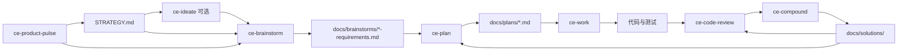
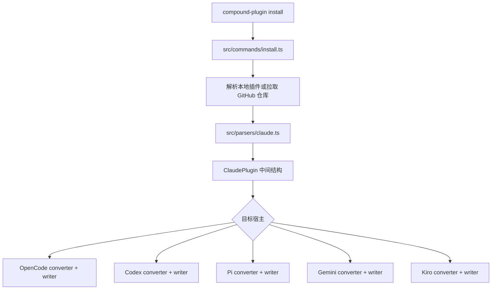

# EveryInc/compound-engineering-plugin 架构分析

## 总体结构

仓库可以分成五层：

1. 插件内容层：`plugins/compound-engineering/` 下的 skills、agents 和插件清单。
2. 分发层：根目录 marketplace 清单和不同宿主的插件元数据。
3. 转换与安装层：`src/` 下的 Bun/TypeScript CLI、解析器、转换器和目标写入器。
4. 知识资产层：`docs/brainstorms/`、`docs/plans/`、`docs/solutions/`。
5. 质量保障层：`tests/`、GitHub Actions、release metadata 同步和校验脚本。

与只包含技能文本的轻量插件相比，Compound Engineering 的架构复杂度主要来自“跨宿主兼容”和“长期迁移安全”。

## 插件内容层

### `plugins/compound-engineering/skills/`

本次源码扫描到 38 个 skill 目录，每个目录以 `SKILL.md` 为入口。重要技能包括：

- 工程主链：`ce-strategy`、`ce-ideate`、`ce-brainstorm`、`ce-plan`、`ce-work`、`ce-debug`、`ce-code-review`、`ce-compound`。
- 知识维护：`ce-compound-refresh`、`ce-sessions`、`ce-slack-research`。
- Git 与交付：`ce-worktree`、`ce-commit`、`ce-commit-push-pr`、`ce-resolve-pr-feedback`、`ce-demo-reel`。
- 专项工具：`ce-test-browser`、`ce-test-xcode`、`ce-frontend-design`、`ce-agent-native-architecture`。

这些技能不只是短提示词。部分技能带有：

- `references/`：按需加载的详细规则和模板。
- `scripts/`：健康检查、worktree 管理、PR 评论处理、frontmatter 校验、演示录制等脚本。
- `assets/`：结构化输出模板。

### `plugins/compound-engineering/agents/`

本次源码扫描到 43 个 Agent Markdown 文件，覆盖：

- 代码审查：正确性、安全、可靠性、性能、测试、可维护性、数据迁移。
- 文档审查：一致性、可行性、产品视角、设计视角、范围控制。
- 调研：仓库结构、Git 历史、框架文档、外部最佳实践、issue、Slack、会话历史。
- 设计和交付：Figma 同步、设计迭代、PR 评论处理、部署核对。

这些 Agent 通常由 skills 调度，用户不需要直接调用。

### 插件清单

重要清单：

- `plugins/compound-engineering/.claude-plugin/plugin.json`
- `plugins/compound-engineering/.codex-plugin/plugin.json`
- `plugins/compound-engineering/.cursor-plugin/plugin.json`
- `.claude-plugin/marketplace.json`
- `.cursor-plugin/marketplace.json`
- `.agents/plugins/marketplace.json`

Codex 清单中的 `skills: "./skills/"` 很关键：它让 Codex 原生插件流程注册 skills，而 Bun CLI 默认只补齐 Codex 当前不原生支持的 custom agents。

## 工程主链的数据流



### `ce-brainstorm`

解决“做什么”。它会按轻量、标准、深度三个级别调整流程强度，并把需求写入 `docs/brainstorms/`。与 Superpowers 的 brainstorming 相比，CE 更强调按任务复杂度控制仪式感，并允许在需求已清楚时缩短流程。

### `ce-plan`

解决“怎么做”。它读取需求文档和仓库上下文，形成结构化实施计划。计划不是逐行脚本，而是决策资产，包含实施单元、范围边界、测试场景和验证条件。

### `ce-work`

执行计划或简短工作描述。它会选择：

- Inline：适合 1 到 2 个小任务。
- Serial subagents：适合存在依赖关系的多个任务。
- Parallel subagents：适合互相独立且通过安全检查的任务。

并行执行前会建立 file-to-unit 映射，检查文件交集，避免多个 Agent 同时写同一文件导致丢失改动。

### `ce-code-review`

多 Agent 审查管线。它会：

1. 确定 diff 范围和意图。
2. 根据风险选择 reviewer。
3. 并行运行专项 Agent。
4. 合并、去重、校验 findings。
5. 根据交互、自动修复、headless 等模式路由后续动作。

### `ce-compound`

这是 CE 与普通编码工作流插件拉开距离的模块。它会把最近解决的问题沉淀为 `docs/solutions/` 下的结构化文档，并通过并行子 Agent：

- 分类问题。
- 提取解决方案。
- 搜索相关已有文档。
- 判断是否应更新已有文档而不是创建重复文档。
- 可选检索历史 session。
- 校验 YAML frontmatter。

## 跨平台转换层

### CLI 入口

`src/index.ts` 使用 `citty` 注册五个子命令：

```text
cleanup
convert
install
list
plugin-path
```

### 安装转换流程



解析器以 Claude Code 插件格式作为中间输入，读取：

- manifest
- agents
- commands
- skills
- hooks
- MCP servers

然后各目标转换器负责名称规范化、工具调用映射、内容改写和文件布局。

### Codex 特殊处理

Codex 当前采用“原生 skills + CLI 补 Agent”的混合策略：

- `.codex-plugin/plugin.json` 让 Codex 原生发现 `./skills/`。
- `src/converters/claude-to-codex.ts` 默认只转换 agents，避免重复注册 skills。
- `src/targets/codex.ts` 写入 TOML Agent 文件、安装清单、MCP 配置和 hooks。
- 写入器会对安装清单路径做边界检查，避免损坏或篡改后的清单触发越界删除。
- 旧版遗留物不会直接删除，而是移动到 `compound-engineering/legacy-backup/`。

这部分代码体现出项目已经经历过多轮真实安装迁移，而不是只停留在概念阶段。

## 测试与发布

### 测试

`tests/` 包含：

- Claude 插件解析测试。
- OpenCode、Codex、Gemini、Pi、Kiro、Copilot、Droid 转换器测试。
- 多平台 writer 测试。
- 路径安全和遗留物清理测试。
- skill frontmatter、命名约束和 shell 安全测试。
- `ce-plan`、`ce-brainstorm`、`ce-worktree`、`ce-setup` 等 skill 契约测试。

### CI

`.github/workflows/ci.yml` 在 GitHub Actions 中执行：

```bash
bun install
bun run release:validate
bun test
```

### 发布同步

`src/release/metadata.ts` 会核对 Claude、Cursor、Codex 和 marketplace 清单之间的版本、描述和插件列表一致性，并统计 skills、agents 和 MCP servers。

## 与 Superpowers 的架构差异

| 架构面 | Compound Engineering | Superpowers |
|--------|----------------------|-------------|
| 核心资产 | skills、专项 agents、转换 CLI、知识文档闭环 | skills 和少量平台适配入口 |
| 会话启动注入 | 主要依赖宿主技能发现和显式 `/ce-*` 入口 | `hooks/session-start` 注入 `using-superpowers`，把技能检查放在每次任务之前 |
| 子 Agent 模型 | 角色库较大，按调研、设计、审查、交付细分 | 任务级 fresh subagent，加规格审查和质量审查 |
| 跨平台方式 | 以 Claude 插件为中间格式，由 TypeScript CLI 转换 | 尽量直接复用同一 skills 目录，仅为宿主补薄适配 |
| 长期记忆 | `docs/solutions/` 和 `ce-compound-refresh` 是一等能力 | 主要保存 spec 和 plan，不提供同等规模的解决方案知识库流程 |

## 风险与取舍

- 技能和 Agent 数量大，维护成本、触发判断和学习成本都高于 Superpowers。
- 多平台转换器需要持续追踪各宿主格式变化。
- 多 Agent 审查可以提升覆盖面，但会增加 token、时间和模型成本。
- 项目 README 的组件数量存在轻微漂移：根 README 写 `37 skills and 51 agents`，插件 README 写 `38+ / 50+`，而本次源码实际扫描到 38 个 skill 目录和 43 个 Agent Markdown 文件。使用时应以当前源码为准。
- 与所有提示词型工作流一样，最终效果仍依赖宿主 Agent 是否可靠遵守技能协议。
