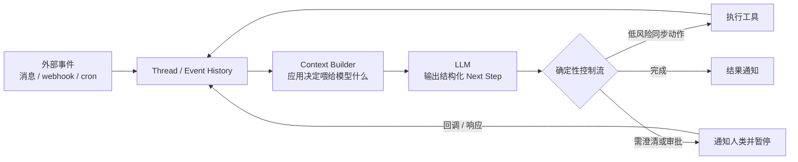
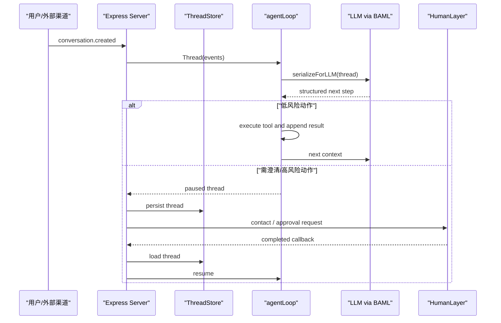

# humanlayer/12-factor-agents 架构分析

## 先明确：它有两层“架构”

本仓库的主要产物是原则文档，而不是一个单一运行时。因此需要分开理解：

- **概念架构**：12 项原则描述的生产级 LLM 应用组织方式。
- **示例架构**：`packages/create-12-factor-agent/template/` 用小型 TypeScript 应用展示部分原则如何落到代码上。

## 仓库结构概览

| 路径 | 作用 |
| --- | --- |
| `README.md` | 项目立场、12 项原则目录、相关阅读入口。 |
| `content/` | 原则正文与附录；同时存在带零补齐和不带零补齐的部分因子文件，阅读时应优先跟随 README 链接。 |
| `img/` | 原则说明与流程图资产。 |
| `packages/create-12-factor-agent/template/` | 教学示例模板，包含 BAML prompt、TypeScript agent loop、HTTP callback 与文件状态存储。 |
| `packages/walkthroughgen/` | 生成 walkthrough 资料的 Node/TypeScript 工具包。 |
| `workshops/` | 多期 workshop 材料。 |
| `Makefile` | 简单依赖安装/清理入口。 |

## 概念架构

仓库的中心模式可以概括为：事件历史是业务事实来源，LLM 读取经过应用选择和格式化的上下文，只输出结构化的“下一步意图”；应用根据风险和流程决定立即执行、等待人类、暂停或恢复。

这个模型中的关键责任分配是：

- LLM 负责在受限 schema 下提出下一步。
- 程序负责执行动作、持久化事件、选择上下文、控制循环和处理权限。
- 人类审批是显式事件流的一部分，而不是额外附加的聊天功能。

## 示例模板结构

### Prompt 与结构化输出

`template/baml_src/agent.baml` 定义 `DetermineNextStep(thread: string)`，其输出联合类型包括：

- `HumanTools`：请求澄清、完成通知、请求经理批准。
- `CalculatorTools`：加减乘除示例工具。
- `CustomerSupportTools`：例如退款动作。

该文件也包含对数学操作、澄清和恢复后行为的 BAML 测试样例。这对应因子 1、2、4 与 7：prompt 是代码，tool 是结构化输出，人类交互也可被建模为 intent。

### 内循环：`src/agent.ts`

- `Thread.events` 保存事件历史。
- `serializeForLLM()` 将事件序列转成 XML 风格片段，体现对 context window 的主动控制。
- `agentLoop()` 调用 BAML 的 `DetermineNextStep`。
- 对 `add`、`subtract`、`multiply` 这类低风险动作，代码立即执行并继续循环。
- 对 `divide`、澄清、完成或审批 intent，代码返回线程，让外围流程处理人类交互。

这段实现直观展示了因子 3、4、8 和 10：LLM 不直接执行业务函数，应用拥有循环与风险分流。

### 状态存储：`src/state.ts`

`FileSystemThreadStore` 将 thread 同时写成：

- `.threads/<id>.json`：结构化事件历史。
- `.threads/<id>.txt`：传给模型的序列化文本。

这是教学层面的简单存储，但很好地展示了因子 5 的想法：执行恢复和可读事件历史尽量来自同一事实来源。

### 外循环：`src/server.ts`

示例 server 使用 Express 和 HumanLayer SDK：

1. `/api/v1/conversations` 接收新会话或人类交互/函数审批完成事件。
2. 新请求创建 `Thread`；callback 请求用 `thread_id` 找回原状态。
3. `agentLoop()` 运行至需要人类输入、审批或结束。
4. 通过 HumanLayer 发出 human contact 或 function call。
5. 人类响应后的 webhook 恢复同一条 thread 并继续处理。

这对应因子 6、7、8 与 11：启动/暂停/恢复、人工审批以及来自外部渠道的 outer loop。

## 数据流与控制流

## 构建、测试与发布线索

- 根目录 `Makefile` 仅提供 `setup` 与 `teardown`，安装策略简单。
- 模板 `package.json` 提供 `dev` 与 `build` scripts。
- BAML 文件内包含 prompt/结构化输出行为测试，模板 README 使用 `npx baml-cli test` 演示执行。
- `packages/walkthroughgen/package.json` 使用 Jest，说明教程生成工具具备单元测试入口。
- GitHub 主页显示没有发布 release；本仓库更像持续演进的内容/教程项目，而非版本化 SDK 分发物。

## 设计取舍

- **减少框架魔法，增加应用责任**：获得 prompt、state、control flow 和审批控制，但团队需要自己建设较多基础设施。
- **事件日志作为核心状态**：便于调试、恢复和 fork；同时需要处理敏感数据、长期压缩与存储治理。
- **小 agent + 确定性编排**：提升可测性与风险控制；可能牺牲某些端到端自治体验。
- **人类回路优先**：适合高风险动作，但会增加延迟、渠道配置与权限管理负担。

## 架构风险与疑点

- 示例模板没有证明完整的生产级身份认证、callback 校验、审计或可靠持久化机制。
- `FileSystemThreadStore` 适合教程，不适合多实例或并发生产服务。
- 静态阅读 `template/src/server.ts` 可见 `store.get(...)` 和 `store.create(...)` 被用于需要实际值的位置但未显式 `await`；由于接口返回 Promise，这是构建前必须验证的潜在实现错误。
- `content/` 中存在部分同主题、不同命名形式的文件，可能来自内容演进；链接和引用宜以 README 当前导航为准。
- README 的原则具有鲜明立场，其中关于框架适用性和生产质量的判断主要来自作者经验，并非仓库提供的独立测评结果。

## 已阅读关键来源

- `README.md`
- `content/factor-01-natural-language-to-tool-calls.md`
- `content/factor-02-own-your-prompts.md`
- `content/factor-03-own-your-context-window.md`
- `content/factor-04-tools-are-structured-outputs.md`
- `content/factor-05-unify-execution-state.md`
- `content/factor-06-launch-pause-resume.md`
- `content/factor-07-contact-humans-with-tools.md`
- `content/factor-08-own-your-control-flow.md`
- `content/factor-09-compact-errors.md`
- `content/factor-10-small-focused-agents.md`
- `content/factor-11-trigger-from-anywhere.md`
- `content/factor-12-stateless-reducer.md`
- `packages/create-12-factor-agent/template/package.json`
- `packages/create-12-factor-agent/template/baml_src/agent.baml`
- `packages/create-12-factor-agent/template/src/agent.ts`
- `packages/create-12-factor-agent/template/src/state.ts`
- `packages/create-12-factor-agent/template/src/server.ts`
