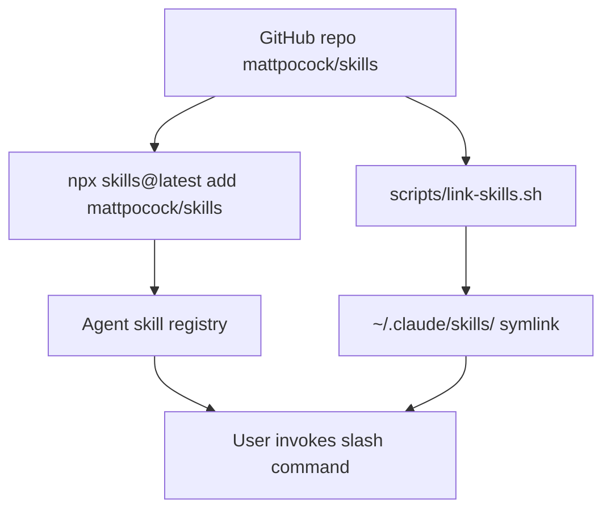
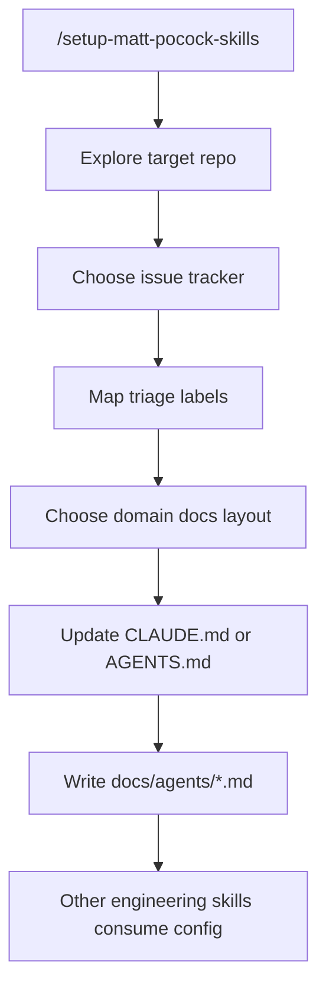

# mattpocock/skills 架构与源码结构

## 结构总览

本仓库不是传统应用，因此“架构”主要体现为文档组织、skill 加载约定和目标仓库配置约定。

核心文件：

```text
.
├── .claude-plugin/plugin.json
├── .out-of-scope/
├── CLAUDE.md
├── CONTEXT.md
├── LICENSE
├── README.md
├── docs/adr/
├── scripts/link-skills.sh
└── skills/
    ├── deprecated/
    ├── engineering/
    ├── misc/
    ├── personal/
    └── productivity/
```

来源：`find . -maxdepth 3 -type f`、`CLAUDE.md`

## Skill 分桶约定

`CLAUDE.md` 定义了仓库维护规则：

- `skills/engineering/`：日常代码工作。
- `skills/productivity/`：非代码生产力工具。
- `skills/misc/`：保留但不常用的工具。
- `skills/personal/`：作者个人设置相关，不推广。
- `skills/deprecated/`：已废弃。

维护约束：

- `engineering`、`productivity`、`misc` 中的每个 skill 必须在顶层 `README.md` 中有引用。
- 同时必须出现在 `.claude-plugin/plugin.json` 中。
- `personal` 和 `deprecated` 不应该出现在 README 或 plugin manifest 中。
- 每个 bucket 的 `README.md` 要列出该 bucket 下全部 skill。

实际观察到一个需要注意的点：`.claude-plugin/plugin.json` 当前列出了 `engineering` 和 `productivity` 的 12 个 skills，但没有列出 `misc` 下的 4 个 skills。这与 `CLAUDE.md` 中“misc 也必须进入 plugin.json”的维护约定存在不一致。尚未确认这是疏漏，还是 plugin 只希望发布部分 skills。

## Plugin manifest

`.claude-plugin/plugin.json` 内容很小：

```json
{
  "name": "mattpocock-skills",
  "skills": [
    "./skills/engineering/diagnose",
    "./skills/engineering/grill-with-docs",
    "./skills/engineering/triage",
    "./skills/engineering/improve-codebase-architecture",
    "./skills/engineering/setup-matt-pocock-skills",
    "./skills/engineering/tdd",
    "./skills/engineering/to-issues",
    "./skills/engineering/to-prd",
    "./skills/engineering/zoom-out",
    "./skills/productivity/caveman",
    "./skills/productivity/grill-me",
    "./skills/productivity/write-a-skill"
  ]
}
```

这说明发布给 Claude plugin 的核心是 skill 目录列表，而不是可执行程序。

## 单个 skill 的结构

典型结构：

```text
skill-name/
├── SKILL.md
├── 参考文件.md
└── scripts/
```

`SKILL.md` 一般包含 YAML front matter：

```yaml
---
name: tdd
description: Test-driven development with red-green-refactor loop...
---
```

部分 skill 使用 `disable-model-invocation: true`，例如 `setup-matt-pocock-skills` 和 `grill-with-docs`。推断：这类 skill 更强调当前 agent 直接按流程与用户交互，而不是再调用模型生成子结果。

## 渐进披露设计

项目大量使用“主 `SKILL.md` + 邻近参考文件”的方式控制上下文大小：

- `tdd/SKILL.md` 引用 `tests.md`、`mocking.md`、`deep-modules.md`、`interface-design.md`、`refactoring.md`。
- `grill-with-docs/SKILL.md` 引用 `CONTEXT-FORMAT.md` 和 `ADR-FORMAT.md`。
- `improve-codebase-architecture/SKILL.md` 引用 `LANGUAGE.md`、`INTERFACE-DESIGN.md`、`DEEPENING.md`。
- `triage/SKILL.md` 引用 `AGENT-BRIEF.md` 和 `OUT-OF-SCOPE.md`。

这与 `write-a-skill/SKILL.md` 的指导一致：`SKILL.md` 应保持精简，超过 100 行或包含高级内容时拆到引用文件；确定性操作则放脚本。

## 配置数据流

### 安装/加载



### 目标仓库初始化



## 核心协作模型

这个仓库的工程 skills 共享三个概念：

- Issue tracker：工作项存放处，可能是 GitHub、GitLab、local markdown 或其他。
- Triage role：issue 在 triage 状态机中的规范角色。
- Domain docs：`CONTEXT.md` 和 ADR，用来让代理使用项目领域语言并尊重历史决策。

这些概念在仓库自身的 `CONTEXT.md` 中也有定义，说明它把“issue tracker / issue / triage role”作为项目领域语言。

## 设计决策

`docs/adr/0001-explicit-setup-pointer-only-for-hard-dependencies.md` 记录了一个重要决策：只有硬依赖目标仓库配置的 skills 才明确提示用户运行 `/setup-matt-pocock-skills`。

分类：

- 硬依赖：`to-issues`、`to-prd`、`triage`。没有 issue tracker 或 label 映射会导致输出错误。
- 软依赖：`diagnose`、`tdd`、`improve-codebase-architecture`、`zoom-out`。没有领域文档仍可工作，只是输出不够精确。

这个 ADR 解释了为什么有些 skill 明确写 “run `/setup-matt-pocock-skills` if not”，有些只泛泛提到领域 glossary 和 ADR。

## 可执行代码

仓库中可执行逻辑很少，主要是两个脚本类别：

- `scripts/link-skills.sh`：把所有 skill 软链接到 `~/.claude/skills`。
- skill 内部脚本，例如：
  - `skills/engineering/diagnose/scripts/hitl-loop.template.sh`
  - `skills/misc/git-guardrails-claude-code/scripts/block-dangerous-git.sh`

项目没有发现 `package.json`、构建脚本、测试框架或 CI 配置。GitHub 页面显示语言为 Shell 100%，这是因为仓库除 Markdown 外只有少量 shell 脚本。

## 扩展方式

新增 skill 的推荐方式见 `skills/productivity/write-a-skill/SKILL.md`：

1. 明确任务/领域和触发场景。
2. 创建 `SKILL.md`。
3. 复杂内容拆为参考文件。
4. 确定性操作放入 `scripts/`。
5. 确保 description 足够清楚，因为它是 agent 决定是否加载 skill 时看到的主要信息。

结合 `CLAUDE.md`，新增公开 skill 还需要更新：

- 顶层 `README.md`
- 对应 bucket `README.md`
- `.claude-plugin/plugin.json`（但当前 misc 不在 manifest，需先确认维护意图）
