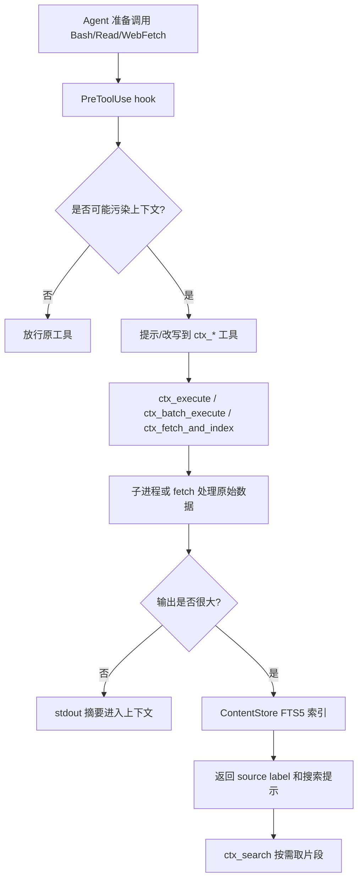
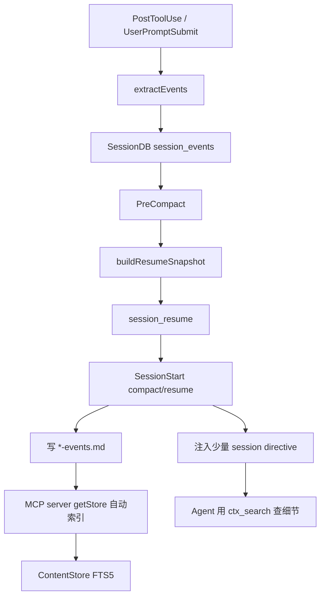

# mksglu/context-mode 架构与源码结构

## 顶层结构

```text
.
├── .claude-plugin/
├── .openclaw-plugin/
├── configs/
├── docs/
├── hooks/
├── insight/
├── scripts/
├── skills/
├── src/
├── tests/
├── package.json
├── server.bundle.mjs
├── cli.bundle.mjs
└── start.mjs
```

## 核心模块

### MCP server

文件：`src/server.ts`

职责：

- 注册 MCP tools。
- 管理 `ContentStore` lazy singleton。
- 统计 context bytes、indexed bytes、sandboxed bytes、cache savings。
- 检查版本过期并提示升级。
- 启动 lifecycle guard 和 stdio MCP server。

核心工具：

- `ctx_execute`
- `ctx_execute_file`
- `ctx_index`
- `ctx_search`
- `ctx_fetch_and_index`
- `ctx_batch_execute`
- `ctx_stats`
- `ctx_doctor`
- `ctx_upgrade`
- `ctx_purge`
- `ctx_insight`

### PolyglotExecutor

文件：`src/executor.ts`

职责：

- 把代码写入真实 OS temp 目录。
- 根据语言选择 runtime。
- Shell 在 project root 执行；其他语言在 temp dir 执行。
- 支持 timeout、background、process tree kill。
- 构造受限环境变量，降低执行污染。
- 支持 Rust 编译后运行、Go/PHP/Elixir 等语言特化。

### Runtime detection

文件：`src/runtime.ts`

支持语言：

- JavaScript
- TypeScript
- Python
- Shell
- Ruby
- Go
- Rust
- PHP
- Perl
- R
- Elixir

Bun 存在时优先用于 JavaScript/TypeScript，以提升执行速度。

### ContentStore

文件：`src/store.ts`

职责：

- SQLite FTS5 内容索引。
- 按 Markdown heading 分块，保留代码块。
- 支持 plain text、JSON、Markdown 等不同索引路径。
- 使用 porter tokenizer 和 trigram tokenizer。
- 使用 BM25 排序、highlight、source/contentType 过滤。
- 支持 fuzzy correction 和查询 fallback。
- 大 chunk 按段落拆分，避免 BM25 长度归一化受损。

### SessionDB

文件：`src/session/db.ts`

职责：

- 持久化 session events、session meta、resume snapshot。
- 每个 session 最多保留 1000 events。
- 支持按类型、优先级、全文搜索等读取。
- 支持 worktree suffix，避免多 worktree 会话混淆。

### Hook layer

目录：`hooks/`

关键文件：

- `hooks/pretooluse.mjs`：路由/拦截大输出工具。
- `hooks/posttooluse.mjs`：抽取工具调用事件写入 SessionDB。
- `hooks/precompact.mjs`：压缩前构建 resume snapshot。
- `hooks/sessionstart.mjs`：注入 routing block 和 session directive。
- `hooks/core/routing.mjs`：跨平台通用路由逻辑。
- `hooks/core/formatters.mjs`：不同平台响应格式。

### Adapter layer

目录：`src/adapters/`

关键文件：

- `types.ts`：`HookAdapter` 接口。
- `detect.ts`：通过 MCP clientInfo、环境变量、配置目录检测平台。
- `client-map.ts`：MCP client name 到 platform id 的映射。
- 各平台目录：`claude-code`、`gemini-cli`、`codex`、`cursor`、`vscode-copilot`、`jetbrains-copilot`、`opencode`、`qwen-code` 等。

`HookAdapter` 统一处理：

- hook 输入解析。
- hook 输出格式化。
- settings path。
- session dir。
- hook config 生成。
- doctor/upgrade 诊断与修复。

## 数据流：大输出处理



## 数据流：会话恢复



关键设计：原始 session events 不直接注入上下文，而是写成 Markdown 后索引。模型只拿到小型指令和建议查询。

## 存储布局

按平台不同，目录不同。以 Claude Code 为例：

```text
~/.claude/context-mode/sessions/<project-hash>.db
~/.claude/context-mode/content/<project-hash>.db
```

旧版本或临时路径：

- `/tmp/context-mode-<PID>.db`
- 平台隔离前的 legacy content dir 会被清理。

## 安全模型

安全相关文件：`src/security.ts`、`hooks/core/routing.mjs`、`src/server.ts`

机制：

- 读取 `.claude/settings.local.json`、`.claude/settings.json`、`~/.claude/settings.json` 中的 permission pattern。
- 支持 Bash deny/allow/ask 规则。
- 将链式 shell 命令拆分，防止通过 `echo ok && sudo rm -rf /` 绕过。
- 对 `ctx_execute` 中非 shell 代码抽取嵌入 shell 命令并检查 deny pattern。
- 对 `ctx_execute_file` 的路径应用 Read deny pattern。

限制：

- server 侧安全检查有 fail-open 注释，hook 是主要 enforcement layer。
- 它不是强隔离容器。沙箱更多是“子进程 + 临时目录 + 环境变量清理 + 输出治理”，不是安全边界。

## 多平台适配

`docs/platform-support.md` 把平台分为：

- JSON stdin/stdout：Claude Code、Gemini CLI、VS Code Copilot、JetBrains Copilot、Cursor、Codex CLI。
- TS Plugin：OpenCode。
- MCP-only：Antigravity、Kiro。

源码实际还包含 Qwen Code、OpenClaw、Pi、Zed 等 adapter/config。平台矩阵文档可能稍落后于代码和 README。

## 构建与发布

`package.json`：

- `build`：`tsc` 后调用 `bundle`。
- `bundle`：用 esbuild 打包 `server.ts`、`cli.ts`、session hook 相关文件。
- `prepublishOnly`：发布前 build。
- `postinstall`：执行 `scripts/postinstall.mjs`。

发布文件包括：

- `build`
- `hooks`
- `configs`
- `insight`
- `server.bundle.mjs`
- `cli.bundle.mjs`
- `skills`
- `.claude-plugin`
- `.openclaw-plugin`
- `start.mjs`

## CI 与测试

CI 文件：`.github/workflows/ci.yml`

矩阵：

- Ubuntu
- macOS
- Windows

步骤：

- Node 20
- Python 3.12
- Go stable
- Elixir 1.17 / OTP 27
- `npm install`
- `npx tsc -b --noEmit`
- `npm run build`
- `npm run bundle`
- `npx vitest run`
- `npx tsx src/cli.ts doctor`（continue-on-error）

测试目录覆盖：

- adapters
- analytics
- core server/search/routing
- hooks
- session
- security
- executor
- runtime
- plugins
- benchmarks

## Benchmark 结论

`BENCHMARK.md` 声称：

- 21 个场景。
- 376 KB raw data -> 16.5 KB context。
- 总体节省 96%。
- 代码示例保留 100%。

`tests/benchmark-results-v04.json` 中一个较早结果显示：

- 198,337 bytes raw -> 12,609 bytes context。
- 平均 savings 94%。

这些结果来自项目内 fixture，适合说明工具设计目标，但不应直接视为所有工作负载的通用保证。

## 架构评价

优点：

- 把 context 节省、会话连续性、routing、诊断和分析整合成完整系统。
- 对多平台差异抽象较清楚，adapter 边界明确。
- 使用 SQLite FTS5 而非外部向量库，部署依赖相对轻。
- CI 覆盖多 OS，测试文件数量较多。

风险：

- 平台 hook 语义差异大，越多平台越容易出现边界 bug。
- 原生 SQLite 依赖和多进程 hook 同时写库，可能带来安装/锁/迁移问题。
- 权限模型复杂，但并非容器级安全。
- `server.ts` 很大，MCP tool、状态统计、升级提示、存储路径、平台修复等关注点集中，后续维护可能吃力。
