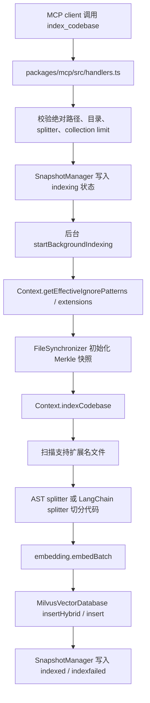
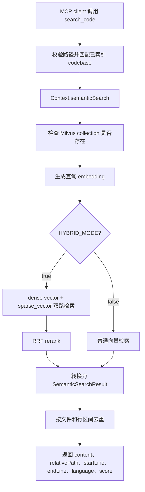

# zilliztech/claude-context 架构与源码结构

## 目录结构

```text
.
├── docs/
├── evaluation/
├── examples/
├── packages/
│   ├── chrome-extension/
│   ├── core/
│   ├── mcp/
│   └── vscode-extension/
├── python/
├── scripts/
├── package.json
├── pnpm-workspace.yaml
└── tsconfig.json
```

`pnpm-workspace.yaml` 包含：

```yaml
packages:
  - packages/*
  - examples/*
```

## 模块分层

### `packages/core`

核心索引引擎，发布名为 `@zilliz/claude-context-core`。

关键文件：

- `src/context.ts`：主门面，负责索引、搜索、清理、同步入口。
- `src/embedding/`：OpenAI、VoyageAI、Gemini、Ollama embedding provider。
- `src/splitter/ast-splitter.ts`：基于 tree-sitter 的 AST 代码切分。
- `src/splitter/langchain-splitter.ts`：LangChain 字符切分 fallback。
- `src/vectordb/milvus-vectordb.ts`：Milvus gRPC 向量数据库实现。
- `src/vectordb/milvus-restful-vectordb.ts`：RESTful 实现。
- `src/sync/synchronizer.ts`：文件哈希、Merkle 快照、增量变更检测。

### `packages/mcp`

MCP server，发布名为 `@zilliz/claude-context-mcp`。

关键文件：

- `src/index.ts`：MCP server 启动、工具注册、stdio transport。
- `src/config.ts`：从环境变量和 `envManager` 构造 MCP 配置。
- `src/embedding.ts`：按 provider 创建 embedding 实例。
- `src/handlers.ts`：实现 `index_codebase`、`search_code`、`clear_index`、`get_indexing_status`。
- `src/snapshot.ts`：读写 `~/.context/mcp-codebase-snapshot.json`。
- `src/sync.ts`：周期同步与 trigger watcher。

### `packages/vscode-extension`

VS Code 扩展，包名 `semanticcodesearch`。

关键文件：

- `src/extension.ts`：扩展激活入口。
- `src/commands/indexCommand.ts`：索引命令。
- `src/commands/searchCommand.ts`：搜索命令。
- `src/commands/syncCommand.ts`：同步命令。
- `src/config/configManager.ts`：读取 VS Code 配置。
- `src/webview/`：侧边栏搜索 UI。

### `evaluation`

Python 评估脚本，用来分析 MCP 效率、构造检索/编辑/read/grep server 对比。它不是主运行路径，但说明项目关注“用 MCP 检索减少上下文/交互成本”的效果评估。

## 主链路：索引代码库



关键点：

- `index_codebase` 返回后索引继续在后台跑。
- 默认 splitter 是 AST；如果 AST 不支持或失败，会 fallback 到 LangChain。
- 默认 hybrid search 会写入 dense vector 和 sparse/BM25 所需字段。
- collection 名由绝对路径 MD5 前 8 位生成，如 `hybrid_code_chunks_<pathHash>`。
- 如果设置 `CODE_CHUNKS_COLLECTION_NAME_OVERRIDE`，仍保留 `<pathHash>` 后缀，避免多个仓库撞 collection。

## 主链路：搜索代码



最新提交 `3675469` 的主题是 “deduplicate overlapping search results”，对应 `Context.deduplicateResults()`：同一文件中行区间重叠超过 50% 的结果会被去重。

## 状态与持久化

MCP server 使用 `~/.context` 保存状态：

- `~/.context/.env`：可选全局配置。
- `~/.context/mcp-codebase-snapshot.json`：codebase 索引状态、进度、文件数、chunk 数、失败原因。
- `~/.context/merkle/<hash>.json`：每个 codebase 的 Merkle 文件快照。
- `~/.context/.sync-trigger`：被修改时触发立即同步。
- `~/.context/mcp-sync.lock`：跨进程同步锁。

`SnapshotManager` 支持 v1/v2 快照格式迁移。v2 中每个 codebase 有 `indexed`、`indexing`、`indexfailed` 等状态。

## 文件选择规则

最终索引文件公式：

```text
Final Files = (All Supported Extensions) - (All Ignore Patterns)
```

扩展名来源：

- 默认扩展名：`.ts`、`.tsx`、`.js`、`.jsx`、`.py`、`.java`、`.cpp`、`.c`、`.h`、`.hpp`、`.cs`、`.go`、`.rs`、`.php`、`.rb`、`.swift`、`.kt`、`.scala`、`.m`、`.mm`、`.dart`、`.md`、`.markdown`、`.ipynb` 等。
- MCP `customExtensions`
- 环境变量 `CUSTOM_EXTENSIONS`

ignore 来源：

- 默认 ignore：`node_modules/**`、`dist/**`、`.git/**`、cache、log、`.env`、minified/bundle/map 等。
- MCP `ignorePatterns`
- 环境变量 `CUSTOM_IGNORE_PATTERNS`
- `.gitignore`
- 项目根目录 `.xxxignore`
- 全局 `~/.context/.contextignore`

来源：`docs/dive-deep/file-inclusion-rules.md`、`packages/core/src/context.ts`

## 代码切分

`AstCodeSplitter` 使用 tree-sitter，支持 JavaScript、TypeScript、Python、Java、C/C++、Go、Rust、C#、Scala 等语言。它按函数、类、接口、类型别名、方法、namespace、impl 等 AST 节点生成 chunk；没有找到合适节点或解析失败时，退回 LangChain splitter。

默认参数：

- AST splitter：`chunkSize=2500`、`chunkOverlap=300`
- VS Code 配置默认显示：`chunkSize=1000`、`chunkOverlap=200`

注意：README 与不同入口中的默认 chunk 参数不完全一致，实际以入口构造代码为准。

## 向量数据库设计

`MilvusVectorDatabase` 创建 collection 时包含：

- `id`
- `vector`
- `content`
- `relativePath`
- `startLine`
- `endLine`
- `fileExtension`
- `metadata`

Hybrid collection 还会包含 sparse vector 相关字段，并使用 hybrid search。collection description 会写入 `codebasePath:<path>`，MCP 同步时会用它从 Zilliz Cloud collection 反推出本地 codebase path。

来源：`packages/core/src/vectordb/milvus-vectordb.ts`、`packages/mcp/src/handlers.ts`

## 并发与同步

`SyncManager` 启动后：

- 5 秒后做一次初始同步。
- 每 5 分钟做一次周期同步。
- 默认启用 trigger watcher，监听 `~/.context/.sync-trigger`。
- 使用 `~/.context/mcp-sync.lock` 避免多个 MCP 进程同时同步。
- 锁默认 10 分钟视为 stale，可通过 `CLAUDE_CONTEXT_SYNC_LOCK_STALE_MS` 调整。

增量同步时，`FileSynchronizer` 比较当前文件哈希与 Merkle 快照：

- removed：删除对应文件 chunks。
- modified：先删旧 chunks，再重新索引。
- added：新增索引。

## 开发、CI 与发布

开发命令来源于 `package.json`：

- `pnpm build`
- `pnpm typecheck`
- `pnpm lint`
- `pnpm clean`
- `pnpm release:core`
- `pnpm release:mcp`
- `pnpm release:vscode`

CI：

- `.github/workflows/ci.yml`
- Ubuntu + Windows
- Node 20、22、24
- 安装依赖后运行 `pnpm build`
- lint 步骤被注释掉

发布：

- tag 匹配 `v*` 或 `c*` 触发
- 发布 core 包、mcp 包到 npm
- 发布 VS Code extension

## 设计取舍

### 优点

- MCP 工具接口很薄，主能力集中在 core 包，复用性较好。
- 异步索引让 agent 不必阻塞等待大型仓库索引完成。
- 用绝对路径 hash 隔离 collection，减少不同仓库之间的数据混淆。
- hybrid search 兼顾语义相似与关键词匹配。
- Merkle 快照支持增量同步，避免每次全量重建。

### 风险

- 状态分散在本地 `~/.context` 和远端 Milvus/Zilliz collection，异常恢复逻辑复杂。
- 绝对路径是 identity，路径变化、symlink、容器挂载路径差异会导致重复索引或搜索不到。
- 依赖 embedding provider 与 Milvus 可用性，离线/内网部署需要额外配置。
- CI 当前主要验证构建，未明显覆盖端到端索引/搜索行为。
